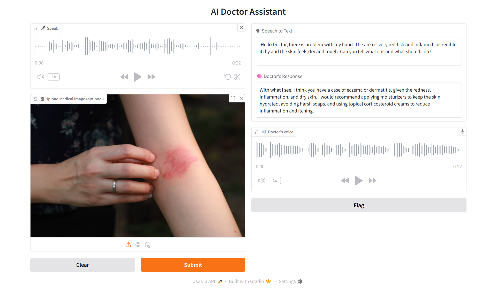

# AI Doctor Assistant

This project is a multimodal AI Doctor Assistant. 
It accepts voice input and medical image, analyzes them using Groq models, and responds with a concise spoken medical opinion.

The system performs:
- Speech-to-Text using Groq Whisper
- Image + Text medical reasoning using a multimodal LLM
- Text-to-Speech response generation
- Interactive UI using Gradio

---

## Features

- Voice-based patient interaction
- Optional medical image upload
- Real-time transcription and diagnosis-style response
- Audio response from the doctor
- End-to-end latency measurement
- Local Gradio UI

---

## Tech Stack

- Python
- Groq API
- Whisper Large v3
- LLaMA multimodal model
- Gradio
- gTTS
- SpeechRecognition
- Pydub

---

---

## Demo Screenshot

## Live 

🔗 https://ai-doctor-assistant-awtb.onrender.com
